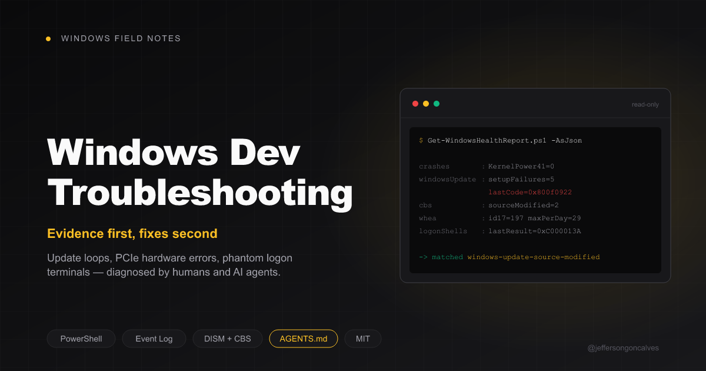

<p align="center">
  
</p>

<h1 align="center">Windows Dev Troubleshooting</h1>

<p align="center">
  Evidence-driven field notes for Windows problems that cost developers hours —<br>
  written to be used by humans <em>and</em> by AI agents.
</p>

<p align="center">
  <a href="AGENTS.md"></a>
  <a href="catalog.json"></a>
  <a href="LICENSE"></a>
</p>

---

Update failures that reboot-loop and look like a dead machine. Terminal windows that
reopen at every logon. Hardware errors hiding behind "random freezes". Antivirus
exclusions that are spelled correctly and do absolutely nothing.

Every page here comes from a real diagnosis on a real machine. Each one shows the
**evidence** — the exact log line or event — then the reasoning, then the fix. Not a
list of commands to paste and hope.

## Why this exists

Most Windows troubleshooting content is either a forum post with no evidence
(*"just run sfc /scannow"*) or vendor documentation that never mentions the failure
mode you actually hit. These notes are the opposite: reproducible commands that print
the evidence, so you can confirm the diagnosis applies to **your** machine before
changing anything.

## Contents

| Guide | Symptom that brings you here |
|---|---|
| [Windows Update 0x800f0922 / CBS_E_SOURCE_MODIFIED](docs/windows-update-0x800f0922-cbs-source-modified.md) | PC reboots 3× on startup, "Working on updates", then rolls back. Looks like it won't boot. |
| [PowerShell window opens at every logon](docs/powershell-window-at-logon.md) | A console flashes or stays open at logon. `-WindowStyle Hidden` doesn't help. |
| [WHEA-Logger Event 17 — PCIe correctable errors](docs/whea-logger-17-pcie-correctable-errors.md) | Whole-system freezes lasting seconds. No BSOD, no disk errors. |
| [Antivirus exclusions that silently do nothing](docs/antivirus-exclusions-that-do-nothing.md) | You added the exclusion and the problem persists. |
| [Kaspersky settings via CLI (avp.com)](docs/kaspersky-avp-cli-settings.md) | You want to script exclusions instead of clicking through a GUI. |
| [Dev toolchain exclusion paths](docs/dev-toolchain-exclusion-paths.md) | Which paths actually matter for Git, Node, pnpm, Composer, PHP, Docker, JetBrains. |

## Quick start

```powershell
git clone https://github.com/jeffersongoncalves/windows-dev-troubleshooting.git
cd windows-dev-troubleshooting
pwsh -File scripts/Get-WindowsHealthReport.ps1
```

That collector is **read-only** — it stops no services, starts no repair, writes no
configuration. It prints the signals every guide keys off:

```
crashes         : Kernel-Power41=0  BugCheck=0  Unexpected=0
windows update  : setupFailures=5  TIreboots=9  lastCode=0x800f0922
cbs             : sourceModified=2
whea            : id17=197  fatal18=0  maxPerDay=29
logon shells    : 1 task(s)
                  \FreezeWatch  logonType=Interactive  lastResult=3221225786  <-- killed by console close
```

Match that output against the guides. If nothing matches, your problem is something
else — don't apply the closest-looking fix.

## For AI agents

This repo is built to be driven by an agent, not just read by one.

- **[AGENTS.md](AGENTS.md)** — the operating protocol: collect → match → report →
  act → verify, plus the hard constraints (never disable protection, never delete
  when you can rename, never put a secret on a command line, always verify by
  reading state back).
- **[catalog.json](catalog.json)** — machine-readable index. Each diagnosis carries
  `symptoms`, the `signal` to inspect, the `match` condition that confirms it,
  `risk`, whether it is `reversible`, and whether it
  `requires_confirmation` before acting.
- **[scripts/Get-WindowsHealthReport.ps1](scripts/Get-WindowsHealthReport.ps1)** —
  `-AsJson` emits an object whose field names are exactly the `signal` paths used in
  the catalog, so matching needs no parsing of prose.

```powershell
pwsh -File scripts/Get-WindowsHealthReport.ps1 -AsJson | ConvertFrom-Json
```

The rule that matters most, for agents and humans alike:

> **Never apply a fix whose evidence you have not observed on this machine.**

Windows failure modes look alike from the symptom alone. A machine that "won't boot"
is usually an update loop; a "freeze" is usually I/O saturation. Their fixes make the
other problem worse.

## Contributing

Hit a Windows problem where the real cause turned out to be non-obvious? Open a PR
with a page in `docs/` and an entry in `catalog.json`. Keep the structure:

**symptom → diagnostic command → evidence → cause → fix → how to verify it worked**

Scrub anything you paste: machine names, usernames, SIDs, internal hostnames,
licence keys, and the contents of security product exports.

## License

MIT — see [LICENSE](LICENSE).
